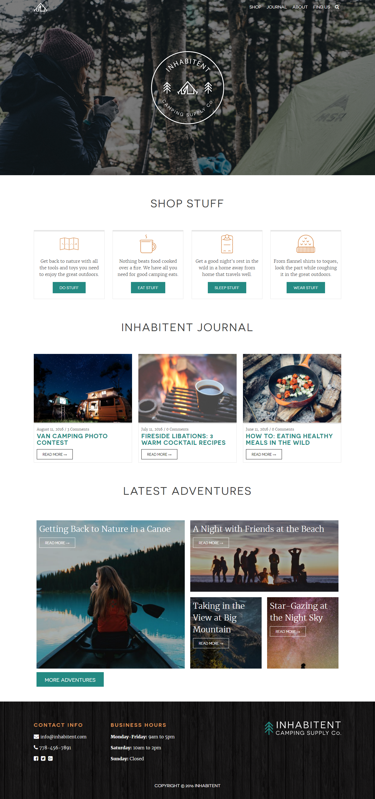

# Inhabitent



## Description
We learned how to use wordpress to build our website. Learned how to make our own custom style/theme to apply to our website. Learned how to use MAMP to have a local database that can host our website. Discovered how to use many different built in WP Functions to call in arrays that contains the posts or items that we need. This is also our first for a multipaged website.

## Software:

```
- Sublime Text (editing)
- Chrome (testing)
- GIT Bash (repo upload)
- Mamp
```

## Technologies Used

```
- html5, css3 , jquery, wordpress' own set of functions
- keeping my codes clean, structured, and easy to read
- Used Font Squirrel to Download Font packages
- Used GIT Bash to push my local repo to Git Hub
- Used WP Plugins to add custom stylings and functionality to the site
- Resizing Search Bar on click
```

## Stretch Goals:

```
- Different Nav Bars on Home, About, Single Adventure Page, achieved with css + js
- Created additional custom post type for Adventures
- Added dash icons to WP Admin Menu
- Added Custom screenshot to Theme
```
